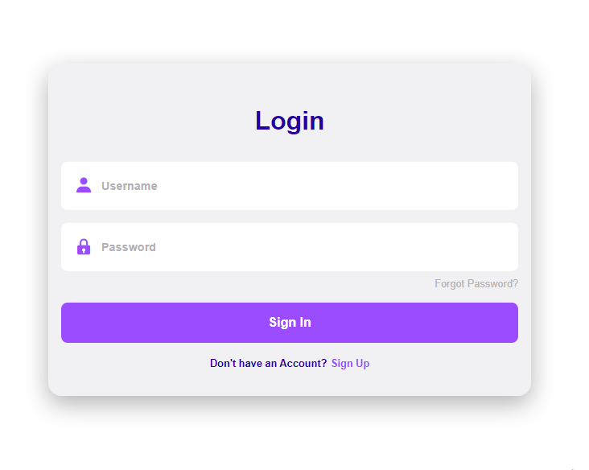
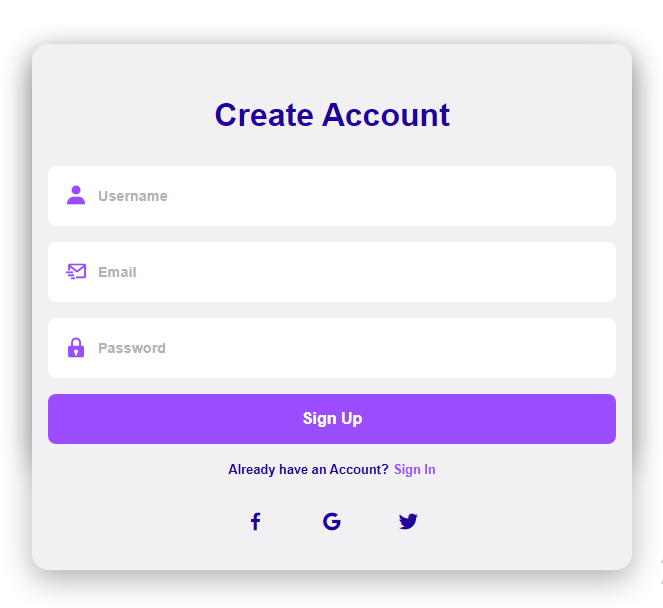
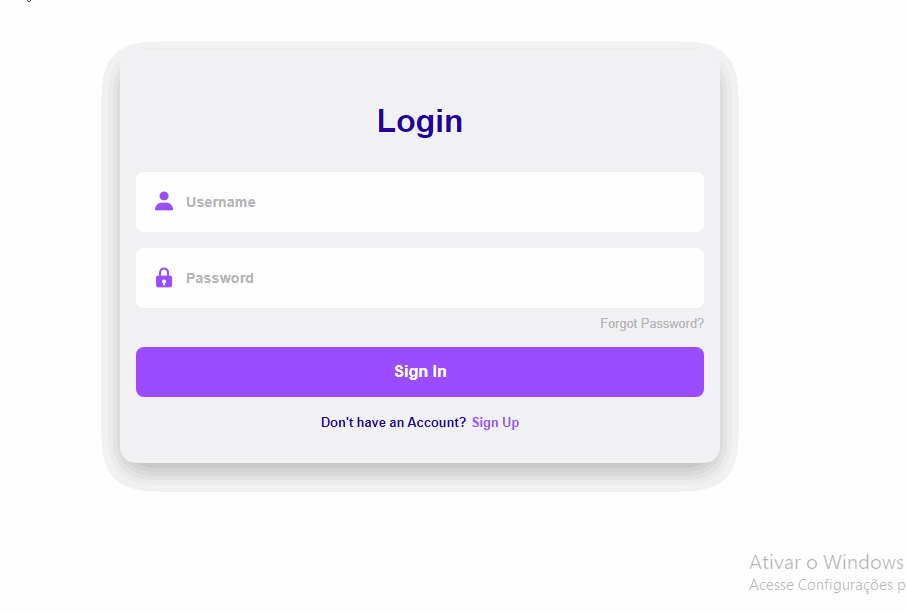

<h1 align="center">
  TELA DE LOGIN
</h1>

  <a href="#-tecnologias">Tecnologias</a>&nbsp;&nbsp;&nbsp;|&nbsp;&nbsp;&nbsp;
  <a href="#-projeto">Projeto</a>&nbsp;&nbsp;&nbsp;|&nbsp;&nbsp;&nbsp;
  <a href="#-layout">Layout</a>&nbsp;&nbsp;&nbsp;|&nbsp;&nbsp;&nbsp;
  <a href="#-como-executar">Como executar</a>&nbsp;&nbsp;&nbsp;|&nbsp;&nbsp;&nbsp;
  <a href="#-executando-a-aplicação">Executando a aplicação</a>

## ✨ Tecnologias

Esse projeto foi desenvolvido com as seguintes tecnologias:

- [HTML](https://developer.mozilla.org/pt-BR/docs/Web/HTML)   

- [CSS](https://developer.mozilla.org/pt-BR/docs/Web/CSS/Reference)   

- [Javascript](https://developer.mozilla.org/pt-BR/docs/Web/JavaScript/Reference)   

## 💻 Projeto

A aplicação corresponde a uma tela de login onde o usuário cria um cadastro, logo esse cadastro é salvo no localStorage do browser.

## 🔖 Layout

   
   

## 🚀 Como executar

- Clone o repositório
- Abra o arquivo index.html no seu navegador
 
## 🎬 Executando a aplicação

  

